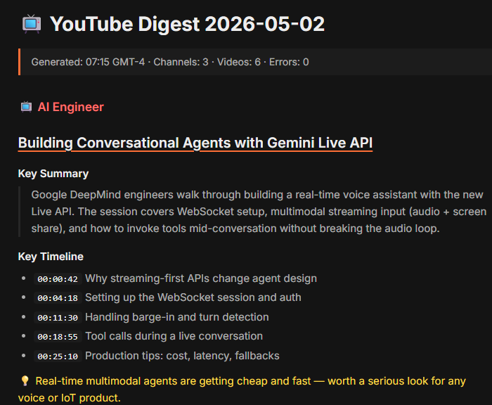

# Daily YouTube Digest

> A small robot that watches your YouTube subscriptions overnight and leaves a clean summary in your Notion before you wake up.



**📖 [See the visual explanation →](https://vascode2.github.io/Daily-Youtube-Digest/)**
*(One-page walkthrough with a flowchart — how it works, what you get, and why it's free.)*

---

## What this is, in plain English

You probably subscribe to a bunch of YouTube channels. Some upload daily. You don't have time to watch all of them. By the time you check, half the videos feel stale.

This project fixes that. Every morning at 7 AM:

1. A computer in the cloud (not yours) wakes up.
2. It checks each channel on your list for new videos uploaded yesterday.
3. It reads each video's transcript and writes a 2–4 sentence summary, plus key timestamps and a one-line takeaway.
4. It drops everything into a fresh page in your Notion.
5. You wake up, open Notion, and skim the digest. Two minutes, done.

You don't run anything. Your laptop can be off. Your phone can be in another country. It just works.

---

## What you actually see

A new Notion page every morning, looking roughly like this:

```
📺 YouTube Digest 2026-05-02
Generated: 07:15 GMT-4 · Channels: 3 · Videos: 6 · Errors: 0

📺 AI Engineer  ← channel name in red

   Building Conversational Agents with Gemini Live API
   Key Summary
   > Google DeepMind engineers show how to build a real-time voice
   > assistant with their new Live API. Covers WebSocket setup,
   > multimodal input, and tool calls during a live conversation.
   Key Timeline
   - 00:04:18  Setting up the WebSocket session
   - 00:18:55  Tool calls during a live conversation
   💡 Real-time multimodal agents are getting cheap and fast.

   Why Building Eval Platforms Is Hard
   Key Summary
   > A Braintrust engineer breaks down why "good" is hard to
   > define for AI outputs. Walks through labeling, versioning,
   > and team-alignment problems most eval teams hit by month 3.
   💡 If you ship AI features, eval pipeline matters more than model.
```

Every video title is a clickable link to YouTube. Channel headers are red so you can scan fast.

---

## The trick: it's free to run

Most "AI summary" tools charge you per summary because they use a paid API.

This system reuses your **Claude Pro subscription** (the same one you use for chatting). One-time setup: copy a token, paste it into GitHub. After that, every run is covered by your subscription. **Added cost: $0.**

GitHub Actions (the cloud runner) is also free for public repos. Notion API is free.

---

## Three ways to use it

| Mode | When | How to start |
|------|------|--------------|
| **Daily auto-digest** | Yesterday's videos, every morning | Already on. Runs at 7 AM EDT. |
| **Weekly recap** | Last 7 days, on demand | Actions tab → `[MANUAL] Weekly YouTube Digest` → Run workflow |
| **Single channel catch-up** | Specific channel, last N videos | Actions tab → `[MANUAL] Channel YouTube Digest` → enter `@handle` and number |

---

## Setup (one-time, ~15 minutes)

You only do this once. After it's done, the daily run happens forever without you touching anything.

### 1. Required accounts (free)
- [GitHub](https://github.com) — hosts the code and runs the daily job
- [Notion](https://notion.so) — destination for digests
- Claude account — for summarization. Pro subscription recommended (saves money) but a free Claude account also works.

### 2. Required tools (free, install once)
- [Node.js](https://nodejs.org) v22+
- [yt-dlp](https://github.com/yt-dlp/yt-dlp/releases) (only needed if you want to test locally)
- [Claude Code CLI](https://docs.claude.com/en/docs/agents-and-tools/claude-code/overview) — `npm install -g @anthropic-ai/claude-code`

### 3. Fork or clone
```bash
git clone https://github.com/vascode2/Daily-Youtube-Digest.git
cd Daily-Youtube-Digest
npm install
```

### 4. List your channels
Edit [config/channels.txt](config/channels.txt) — one YouTube handle per line:
```
@MyFavoriteChannel
@AnotherChannel
```

### 5. Connect Notion
1. Go to https://www.notion.so/my-integrations → **+ Create new connection**
2. Name it `YouTube Digest`, type **Internal**, save → copy the secret (`ntn_…`)
3. In Notion, create a page named "YouTube Summary" (any name works)
4. On that page: **`···`** menu → **Connections** → add your `YouTube Digest` integration
5. Copy the page's URL — the 32-character ID at the end is your `NOTION_PAGE_ID`

### 6. Get a Claude Code token
In your terminal:
```bash
claude setup-token
```
Copy the `sk-ant-oat01-…` token from the terminal output.

### 7. Get YouTube cookies (so the cloud server isn't blocked)
1. Install the Chrome extension [Get cookies.txt LOCALLY](https://chromewebstore.google.com/detail/get-cookiestxt-locally/cclelndahbckbenkjhflpdbgdldlbecc)
2. Visit https://www.youtube.com (logged in)
3. Click the extension → **Export As** → **Netscape format** → save the file
4. Convert to base64 (PowerShell):
   ```powershell
   $b64 = [Convert]::ToBase64String([IO.File]::ReadAllBytes("$HOME\Downloads\youtube.com_cookies.txt"))
   Set-Clipboard -Value $b64
   ```
   *(or `base64 -w0 youtube.com_cookies.txt | pbcopy` on Mac/Linux)*

### 8. Add 4 secrets to GitHub
Go to https://github.com/YOUR_USERNAME/Daily-Youtube-Digest/settings/secrets/actions and add:

| Name | Value |
|------|-------|
| `CLAUDE_CODE_OAUTH_TOKEN` | the `sk-ant-oat01-...` token from step 6 |
| `NOTION_TOKEN` | the `ntn_...` token from step 5 |
| `NOTION_PAGE_ID` | the 32-char page ID from step 5 |
| `YOUTUBE_COOKIES_B64` | the base64 cookies from step 7 |

### 9. Test it
Go to the **Actions** tab → `[AUTO] Daily YouTube Digest` → **Run workflow** → wait 5 minutes → check your Notion.

That's it. Tomorrow at 7 AM it runs by itself.

---

## Folder structure

```
.
├── docs/index.html             # Visual walkthrough (this is what github.io serves)
├── CLAUDE.md                   # Instructions Claude Code reads to understand the project
├── agents/                     # Sub-agent role definitions (collect/summarize/review/publish)
├── config/
│   ├── channels.txt            # Your YouTube channel list
│   ├── format.md               # Output format spec
│   └── keywords.txt            # Optional keyword filter
├── scripts/
│   ├── collect.js              # Fetches videos with yt-dlp
│   ├── review.js               # Quality-checks summaries
│   └── publish.js              # Saves to Notion + repo
├── .github/workflows/
│   ├── daily-digest.yml        # 7 AM EDT auto-cron
│   ├── weekly-digest.yml       # On-demand weekly
│   └── channel-digest.yml      # On-demand single channel
└── output/                     # Generated digest archive (committed to repo)
```

---

## Customizing

| Want to change… | Edit this file |
|---|---|
| Which channels are watched | `config/channels.txt` |
| The output format/style | `config/format.md` |
| Tone, audience, language | `agents/summarizer.md` |
| When the daily runs | `cron:` line in `.github/workflows/daily-digest.yml` |
| Filter videos by keyword | uncomment lines in `config/keywords.txt` |
| Switch to a faster/cheaper model | `--model` flag in workflow files |

---

## Troubleshooting

**"No videos collected"** — yesterday simply had no uploads from your channels, OR your YouTube cookies expired. Refresh the cookies (step 7 above) every ~60 days.

**"You've hit your limit"** — Claude Pro has a 5-hour rolling usage window. If you've been chatting with Claude a lot, the workflow shares that quota. Wait until the limit resets or upgrade your subscription.

**Notion page not appearing** — check that the parent page is shared with your `YouTube Digest` integration (Connections menu). Then refresh Notion.

**Workflow shows red X but Notion has the page** — usually a temporary git push race. Re-running fixes it; the Notion publish already succeeded.

---

## License

MIT. Use it, fork it, modify it.

---

## Credits

- Original concept inspired by [@dekilab](https://www.youtube.com/@dekilab)'s Claude Code workflow tutorial
- Built with [Claude Code](https://claude.com/claude-code), [yt-dlp](https://github.com/yt-dlp/yt-dlp), [Notion API](https://developers.notion.com)
